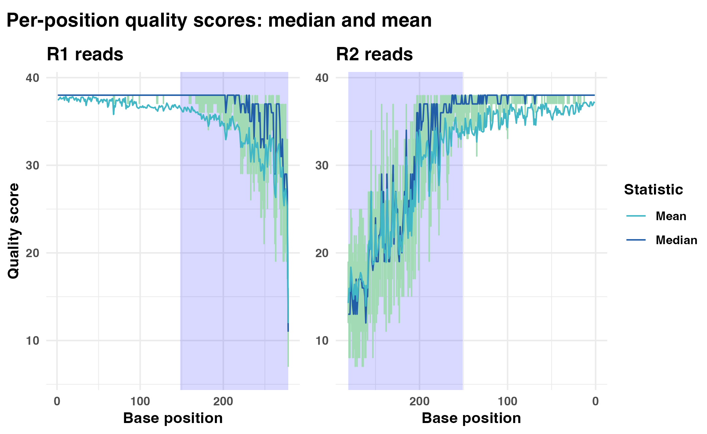
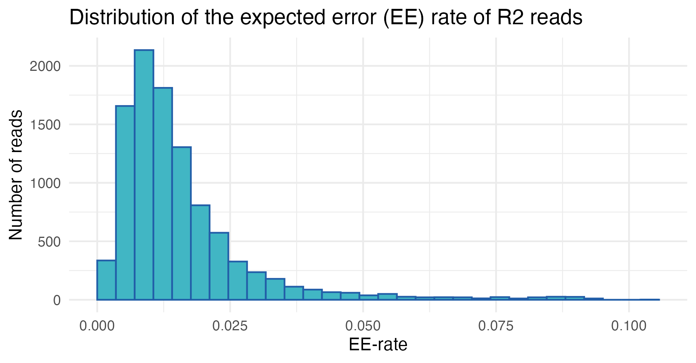
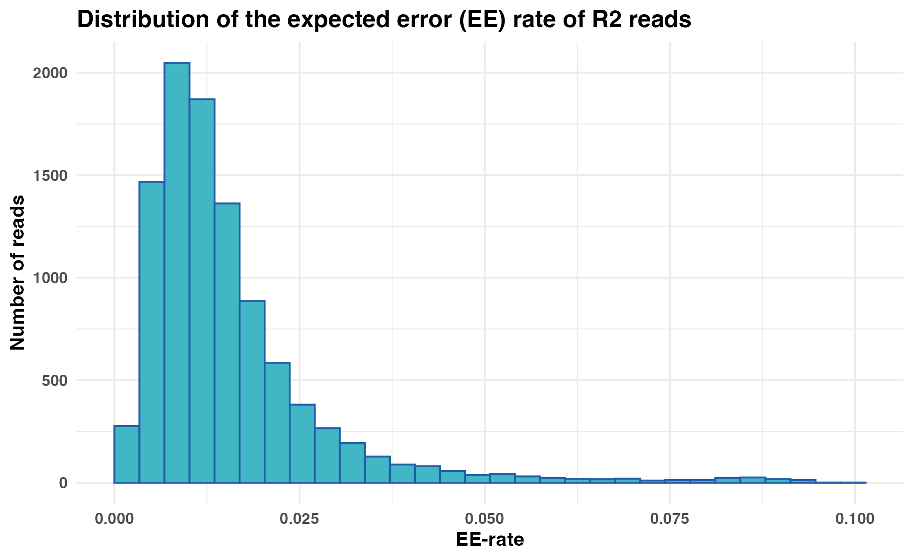
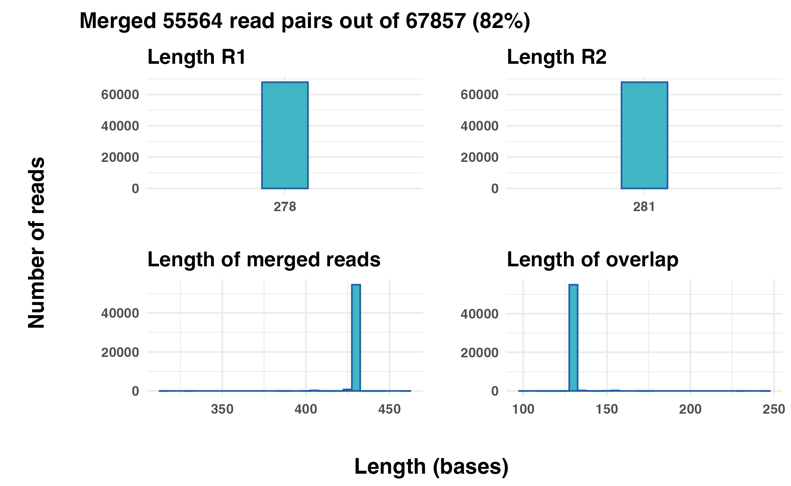
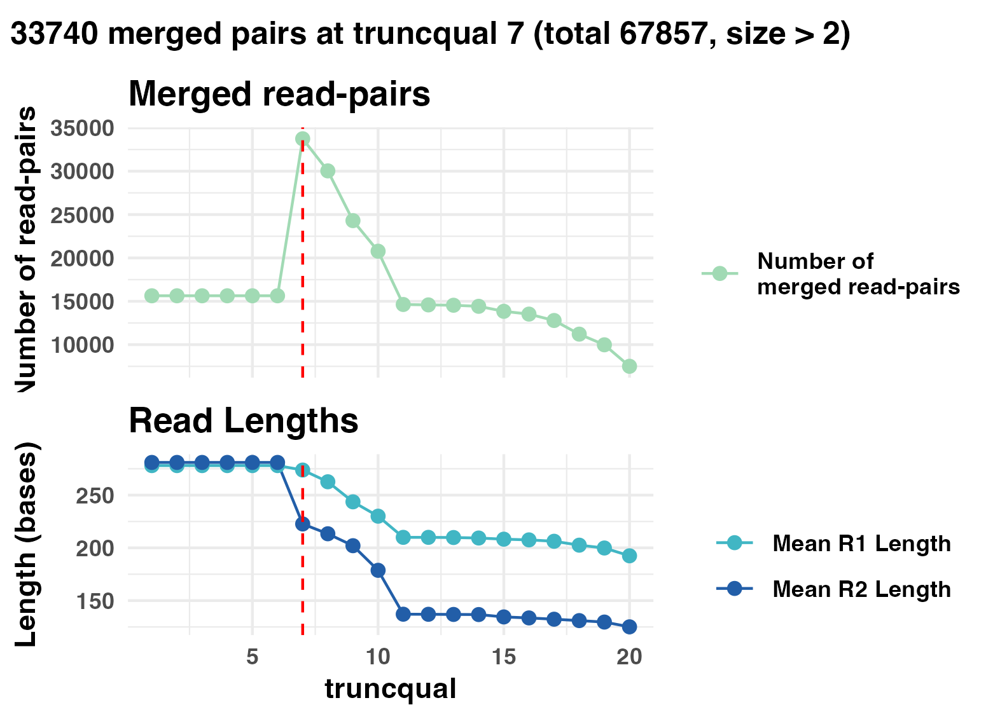
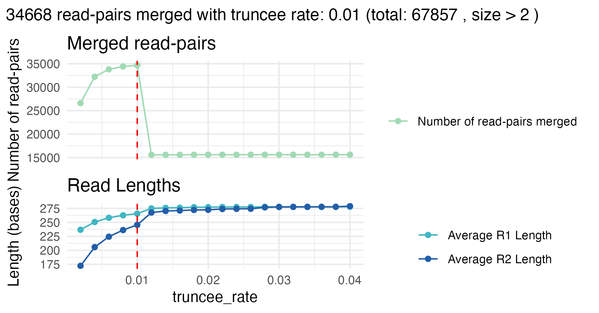
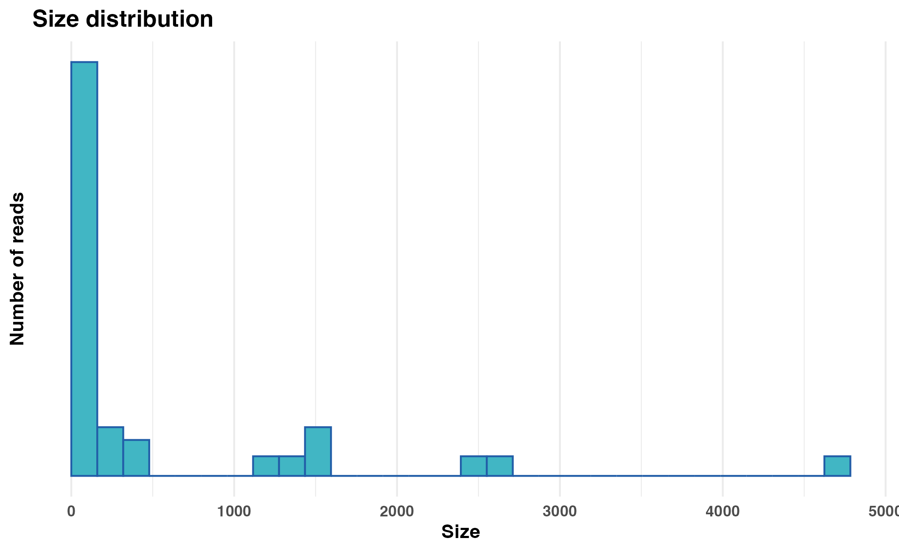
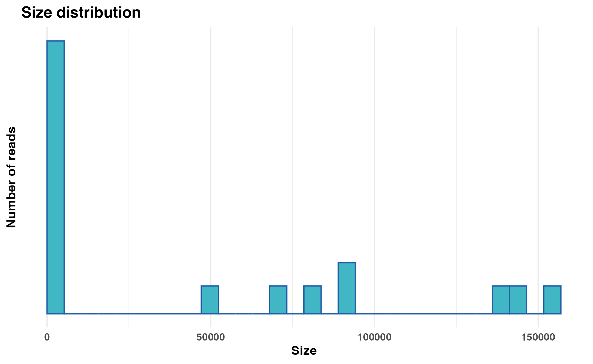

```{r setup_knitr, include = FALSE}
# pkgdown sets IN_PKGDOWN="true" while building
in_pkgdown <- identical(Sys.getenv("IN_PKGDOWN"), "true")

options(readr.show_col_types = FALSE)

knitr::opts_chunk$set(
  collapse = FALSE,
  comment  = "",
  # run code only when you're knitting interactively OR when pkgdown is building
  eval     = interactive() || in_pkgdown
)
```

# Introduction

`Rsearch` is an R package designed for handling and analyzing targeted sequencing data. The package provides a user-friendly interface for core `VSEARCH` functions in addition to tools for visualization and parameter optimization.

In this tutorial, we will walk through an example workflow using the `Rsearch` package to process a small multi-sample dataset. For this tutorial, we will use Illumina-sequenced paired-end reads, stored in FASTQ files and separated by sample. 

Using `Rsearch`, we will demonstrate how to perform key processing steps, including:

* [Inspecting raw data](#inspect-the-raw-data)
* [Trimming and filtering](#trimming-and-filtering)
* [Merging read pairs](#merging-trimmed-and-filtered-reads)
* [Dereplicate reads](#dereplicating-the-merged-reads)
* [Chimera detection](#chimera-detection)
* [Clustering reads into OTUs](#clustering)
* [Taxonomic assignment](#assign-taxonomy)

Finally, we will show how the data generated in `Rsearch` can be imported into the `phyloseq` R package for downstream microbiome analysis. You can jump directly to that section [here](#handoff-to-phyloseq).

## For the impatient

If you prefer to run the entire example workflow without inspecting intermediate steps, a streamlined version is provided at the [end of the tutorial](#full-pipeline-short-version), using the pipe operator.

# Installing `Rsearch`

To install `Rsearch` from GitHub, you will first need the `devtools` package. If it's not installed yet, you can install it by running: 

```{r install_devtools, eval = FALSE}
# Install devtools if not already installed
if (!requireNamespace("devtools", quietly = TRUE)) {
  install.packages("devtools")
}
```

If you don't already have it, you will need to install the `phyloseq` package before installing `Rsearch`:

```{r install_phyloseq, eval = FALSE}
# Install phyloseq if not already installed
if (!requireNamespace("BiocManager", quietly = TRUE)) {
  install.packages("BiocManager")
}
BiocManager::install("phyloseq")
```

Now you are ready to install `Rsearch`:

```{r install_rsearch, eval = FALSE}
# Install Rsearch from GitHub
devtools::install_github("CassandraHjo/Rsearch")
```

After installation, it is a good idea to restart your R session (in Rstudio: *Session* > *Restart R*) to make sure everything is properly loaded. 

`Rsearch` requires that you have `VSEARCH` installed. `VSEARCH` performs the heavy computational tasks quickly, while `Rsearch` allows you to run these operations conveniently from within R. Without `Rsearch`, you would need to run `VSEARCH` commands manually from the command line.

Installation instruction for `VSEARCH` are available on the [Rsearch GitHub page](https://github.com/CassandraHjo/Rsearch){target="blank"}.

You can verify the installation of both `Rsearch` and `VSEARCH` by running:

```{r test_rsearch_install}
library(Rsearch)
packageVersion("Rsearch")
vsearch()
```

# Getting started

## Example data

The example data set in this tutorial is a subset of the samples from the publicly available project [Sequencing marine seafloor samples](https://www.ncbi.nlm.nih.gov/bioproject/?term=PRJNA1034510){target="blank"}.

[Download a zipped archive with example data here](https://github.com/CassandraHjo/Rsearch/releases/download/v1.0-data/tutorial_data.zip){target="blank"}

The data set contains samples with zymbiomics mock communities. 

After unpacking the zipped archive you should have:

* A text-file `metadata.txt`
* A folder named `fastq` with 16 pairs of FASTQ files.

First, define the paths to your FASTQ files and metadata file:

```{r path_example_data, eval=FALSE}
fastq_path <- "../tutorial_data/fastq"           # Change to the directory containing the FASTQ files
metadata_file <- "../tutorial_data/metadata.txt" # Change to the file path of your metadata file
```

If you see the expected files listed and no errors, you are ready to proceed.

## Load required libraries

Load the libraries needed for this tutorial:

```{r load_libraries, message=FALSE, warning=FALSE, eval=TRUE}
library(Rsearch)
library(microseq)
library(readr)
library(scales)
```

# Inspect the raw data

First, we read the metadata file:

```{r read_metadata, eval=FALSE}
sample.tbl <- read_tsv(metadata_file)
cat("Number of samples in the metadata file: ", nrow(sample.tbl), "\n")
```

```{r echo=FALSE, messge=FALSE}
sample.tbl <- read_tsv("data/metadata.txt")
cat("Number of samples in the metadata file: ", nrow(sample.tbl), "\n")
```

## Read quality

To help you run the tutorial interactively, we have included a `break` statement inside some `for`-loops. This causes the `for`-loop to stop after processing the first sample, allowing you to quickly preview results. You can simply remove the break line to process all samples.

We assess the read quality using `plot_base_quality`, which plots the mean and median base quality scores across all bases for each read. Error bars show the interquartile range (25th to 75th percentiles). Note that the x-axis for the R2 panel has been flipped to remind us that R1 and R2 reads are sequenced in opposite directions.

```{r plot_base_quality_raw, message=FALSE, eval=FALSE}
for(i in 1:nrow(sample.tbl)){
  R1.tbl <- readFastq(file.path(fastq_path, sample.tbl$R1_file[i]))
  R2.tbl <- readFastq(file.path(fastq_path, sample.tbl$R2_file[i]))
  
  gg.obj <- plot_base_quality(R1.tbl, R2.tbl, show_overlap_box = TRUE)
  print(gg.obj)
  break # Remove this line to loop through all samples
}
```

{alt=""}

In the first sample, we see that the R1 reads have generally higher and more stable quality compared to the R2 reads, which is a common feature of Illumina paired-end sequencing. The shaded regions at the curve end represent the average overlap length when merging the paired-end reads, offering insight into the quality within those overlapping segments. As expected, read quality declines toward the ends, especially for the R2 reads, suggesting that trimming and filtering may be necessary before proceeding with downstream analyses.

## Expected Error (EE) rate distribution

We can also explore the distribution of expected error (EE) rates across reads, which provides a measure of read quality (lower EE rates indicate higher quality).

```{r plot_ee_distribution, eval=FALSE}
for(i in 1:nrow(sample.tbl)){
  R1.tbl <- readFastq(file.path(fastq_path, sample.tbl$R1_file[i]))
  R2.tbl <- readFastq(file.path(fastq_path, sample.tbl$R2_file[i]))
  
  R1.gg.obj <- plot_ee_rate_dist(R1.tbl,
                                 plot_title = "Distribution of the expected error (EE) rate of R1 reads")
  R2.gg.obj <- plot_ee_rate_dist(R2.tbl,
                                 plot_title = "Distribution of the expected error (EE) rate of R2 reads")
  
  print(R1.gg.obj)
  print(R2.gg.obj)
  break # Remove this line to loop through all samples
}
```

{alt=""}
{alt=""}

In the first sample, most reads have low expected error rates, as indicated by the left-skewed distributions. However, a subset exhibits higher EE rates, suggesting the precence of low-quality reads that require further inspection and may be candidates for removal. 

# Trimming and filtering

Choosing the best trimming and filtering settings is important for obtaining good merging results. 

* **Trimming**: Removing poor-quality bases from the ends of the reads. 
* **Filtering**: Removing whole reads with poor quality. 

`Rsearch` provides two new helper functions, `vs_optimize_truncqual` and `vs_optimize_truncee_rate`, to optimize the trimming. These functions search parameter combinations to find the settings that yield the best merging results. For details, see the section on [optimizing trimming settings](#optimizing-trimming-settings). 

## Merging raw reads

As an optional but informative step, merging the raw reads before trimming and filtering can help establish a baseline understanding of read overlap and merging success. 

Here we try to merge all the reads we have got for the first sample, without any trimming and filtering. The `vs_merging_lengths` function can be used to plot some merging statistics:

```{r merge_raw_reads, eval=FALSE}
for(i in 1:nrow(sample.tbl)){
  R1.tbl <- readFastq(file.path(fastq_path, sample.tbl$R1_file[i]))
  R2.tbl <- readFastq(file.path(fastq_path, sample.tbl$R2_file[i]))
  
  merging_raw.tbl <- vs_merging_lengths(fastq_input = R1.tbl, 
                                        reverse = R2.tbl)
  
  print(attr(merging_raw.tbl, "plot"))
  print(data.frame(attr(merging_raw.tbl, "statistics")))
  break # Remove this line to loop through all samples
}
```

{alt=""}

```{r echo=FALSE, message=FALSE}
knitr::kable(read_tsv("data/merging_raw_tbl.tsv"))
```

From the first sample, approximately 82% (55 564 out of 67 857) of the read pairs merged successfully. From the two top panels we can see the length distribution of the R1 and R2 reads. In this case all of the R1 and R2 reads are of equal length: 278 and 281 bases long, respectively. 

The two bottom panels show the distribution of the length of the merged reads, and the distribution of the overlap length. In this example, almost all merged reads have a length of around 430 bases, and the length of the overlap is around 130 bases. 

The results from merging the raw reads above includes singletons, merged read pairs with a copy number of 1. If we assume that sequencing errors are more likely to occur among singletons and remove them, we are left with approximately 49% (33 259 out of 67 857) successfully merged read pairs when merging the raw read pairs. This experiment can easily be performed using the `vs_fastq_mergepairs` and `vs_fastx_uniques` functions, as shown below.

```{r eval=FALSE}
library(stringr)
library(tidyverse)

m_raw.tbl <- vs_fastq_mergepairs(R1.tbl,
                                 R2.tbl,
                                 minovlen = 10,
                                 minlen = 0,
                                 threads = 1)

d_raw.tbl <- vs_fastx_uniques(m_raw.tbl) %>% 
  mutate(size = str_extract(Header, "(?<=;size=)\\d+")) %>% 
  mutate(size = as.numeric(size)) %>% 
  filter(size > 1)

sum(d_raw.tbl$size)
```

Together this tells us:

* We should discard the very short reads, and we may set a threshold at 50 bases.
* The rather long overlap means we may trim the 3' ends of the reads quite a lot and still maintain a long enough overlap to merge.

## Optimizing trimming settings

At this stage, `Rsearch` introduces a new step in the pipeline: optimizing the trimming of reads to improve merging results. The aim is not only to maximize the number of merged reads, but also to ensure that the merged reads are of high quality. For this purpose, 'Rsearch' introduces two new functions that systematically explore ranges of `truncqual` and `truncee_rate` values and report the settings that give the best result. Although the optimization is run on a single sample, we find that samples from the same sequencing run usually behave similarly. We still assume that sequencing errors are more frequent among singletons, the evaluation focuses on merged reads with a copy number of 2 or more. We assume that a larger number of such reads is taken as evidence for better merging. During optimization the reads are also filtered to remove the reads with average expected error greater than 0.01 (default). This threshold can be adjusted via the `maxee_rate` parameter when working with other datasets.   

### Optimize `truncqual` value

The `vs_optimize_truncqual` function finds the optimal `truncqual` value for truncating reads, i.e. trimming at the 3' end. The `truncqual` value is the quality score threshold at which the reads are truncated, starting from the first base. The function tests a range of `truncqual` values and visualizes the effect on merging success. The optimal `truncqual` value is measured by the number of merged read pairs with a copy number above the number specified by `min_size`, after dereplication.

The function may take some time to run, but you can view the progress through a progress bar in the console. 

```{r optimize_truncqual, fig.keep='all', message=FALSE, warning=FALSE, results='hide', eval=FALSE}

for(i in 1:nrow(sample.tbl)){
  R1.tbl <- readFastq(file.path(fastq_path, sample.tbl$R1_file[i]))
  R2.tbl <- readFastq(file.path(fastq_path, sample.tbl$R2_file[i]))
  
  optimize_truncqual.tbl <- vs_optimize_truncqual(fastq_input = R1.tbl, 
                                                  reverse = R2.tbl,
                                                  sample_size = NULL
  )
  
  print(attr(optimize_truncqual.tbl, "plot"))
  
  break # Remove this line to loop through all samples
}
```

{alt=""}

For the first sample, the best `truncqual` value is 7. At this setting, approximately 50% (33 740 out of 67 857) read pairs are successfully merged. 

Although this number is just slightly higher compared to the results from the raw merging, the important difference is that only high-quality merged reads with copy number 2 or more and an average expected error below 0.01 are considered here. Thus, trimming with `truncqual = 7` effectively retains higher-confidence reads at the cost of discarding lower-quality ones, which is exactly what we want.

Why not merge all reads here? Because singleton reads often have sequencing errors, and this will affect the merging. We base the optimization entirely on multicopy or high-quality reads.

### Optimize `truncee_rate` value

Similarly, the `vs_optimize_truncee_rate` function optimizes the trimming with the `truncee_rate` parameter rather than `truncqual`. The `truncee_rate` value truncates the sequences so that their average expected error per base is not higher than the specified value. The function tests a range of `truncee_rate` values and visualizes the effect on merging success. The optimal `truncee_rate` value is measured by the number of merged read pairs with a copy number above the number specified by `min_size`, after dereplication.

The function may take some time to run, but you can view the progress through a progress bar in the console. 

```{r optimize_truncee_rate, fig.keep='all', message=FALSE, warning=FALSE, results='hide', eval=FALSE}

for(i in 1:nrow(sample.tbl)){
  R1.tbl <- readFastq(file.path(fastq_path, sample.tbl$R1_file[i]))
  R2.tbl <- readFastq(file.path(fastq_path, sample.tbl$R2_file[i]))
  
  optimize_truncee_rate.tbl <- vs_optimize_truncee_rate(fastq_input = R1.tbl, 
                                                        reverse = R2.tbl,
                                                        sample_size = NULL
  )
  
  print(attr(optimize_truncee_rate.tbl, "plot"))
  
  break # Remove this line to loop through all samples
}
```

{alt=""}

The optimal `truncee_rate` for this sample is 0.01, with approximately 51% (34 668 out of 67 857) successfully merged read pairs. Again, the number of merged read pairs is just slightly higher compared to merging raw reads, but here the reads retained are of higher quality and reliability, because singletons and low quality reads are removed, which is critical for downstream clustering and analysis.

Based on the results from the optimization plots, the `truncqual` and `truncee_rate` values can be set in the trimming and filtering function: `vs_fastx_trim_filt`.

## Trimming and filtering reads

Now we apply trimming and filtering using reasonable parameters. We will use the same `for`-loop as above to loop through all samples, but this time we will add the `vs_fastx_trim_filt` function to trim and filter all the reads. 

```{r trim_filter, eval=FALSE}
for(i in 1:nrow(sample.tbl)){
  R1.tbl <- readFastq(file.path(fastq_path, sample.tbl$R1_file[i]))
  R2.tbl <- readFastq(file.path(fastq_path, sample.tbl$R2_file[i]))
  
  # Trim and filter
  R1_filt.tbl <- vs_fastx_trim_filt(R1.tbl, R2.tbl,
                                    minlen = 50,
                                    truncee_rate = 0.01,
                                    stripleft = 12)
  R2_filt.tbl <- attr(R1_filt.tbl, "reverse")
  
  print(data.frame(attr(R1_filt.tbl, "statistics")))
  break # Remove this line to loop through all samples
}
```

```{r echo=FALSE, messge=FALSE}
knitr::kable(read_tsv("data/filt_stats.tsv"))
```

We also trim 12 bases from the 5' end (`stripleft = 12`) of each read, based on the earlier quality assessment.

We can again assess the read quality after trimming and filtering using `plot_base_quality`:

```{r plot_base_quality_trimmed, message=FALSE, warning=FALSE, eval=FALSE}
for(i in 1:nrow(sample.tbl)){
  R1.tbl <- readFastq(file.path(fastq_path, sample.tbl$R1_file[i]))
  R2.tbl <- readFastq(file.path(fastq_path, sample.tbl$R2_file[i]))
  
  # Trim and filter
  R1_filt.tbl <- vs_fastx_trim_filt(R1.tbl, R2.tbl,
                                    minlen = 50,
                                    truncee_rate = 0.01,
                                    stripleft = 12)
  R2_filt.tbl <- attr(R1_filt.tbl, "reverse")
  
  gg.obj <- plot_base_quality(R1_filt.tbl, R2_filt.tbl, show_overlap_box = TRUE)
  print(gg.obj)
  break # Remove this line to loop through all samples
}
```

{alt=""}

The plot shows that the read quality has improved after trimming and filtering. After trimming, the base quality scores in plot two are consistently higher across all positions. 

# Merging trimmed and filtered reads

After trimming and filtering, we merge the read pairs using the `vs_fastq_mergepairs` function. We then expand our previous `for`-loop to include merging like this:

```{r merge_trimmed_filtered, eval=FALSE}
for(i in 1:nrow(sample.tbl)){
  R1.tbl <- readFastq(file.path(fastq_path, sample.tbl$R1_file[i]))
  R2.tbl <- readFastq(file.path(fastq_path, sample.tbl$R2_file[i]))
  
  # Trim and filter
  R1_filt.tbl <- vs_fastx_trim_filt(R1.tbl, R2.tbl,
                                    minlen = 50,
                                    truncee_rate = 0.01,
                                    stripleft = 12)
  R2_filt.tbl <- attr(R1_filt.tbl, "reverse")
  
  # Merge reads
  merged.tbl <- vs_fastq_mergepairs(R1_filt.tbl, R2_filt.tbl)
  
  print(data.frame(attr(merged.tbl, "statistics")))
  break # Remove this line to loop through all samples
}
```

```{r echo=FALSE, message=FALSE}
knitr::kable(read_tsv("data/merging_filt_stats.tsv"))
```

In the statistics table from the merging one can see the total number of read pairs, the number of merged reads, and length statistics about the reads before and after merging. For this sample 58 323 out of 60 977 read pairs were successfully merged. The mean read length after merging is approximately 405 bases, with a standard deviation of 2.3 bases. 

# Dereplicating the merged reads

The merged reads are dereplicated to remove redundancy using the `vs_fastx_uniques` function. We expand our `for`-loop to include dereplication. We want to add the sample identifier to the header of each sequence, and this is done by using the `sample` parameter.

```{r dereplicate_merged_reads, eval=FALSE}
for(i in 1:nrow(sample.tbl)){
  R1.tbl <- readFastq(file.path(fastq_path, sample.tbl$R1_file[i]))
  R2.tbl <- readFastq(file.path(fastq_path, sample.tbl$R2_file[i]))
  
  # Trim and filter
  R1_filt.tbl <- vs_fastx_trim_filt(R1.tbl, R2.tbl,
                                    minlen = 50,
                                    truncee_rate = 0.01,
                                    stripleft = 12)
  R2_filt.tbl <- attr(R1_filt.tbl, "reverse")
  
  # Merge reads
  merged.tbl <- vs_fastq_mergepairs(R1_filt.tbl, R2_filt.tbl)
  
  # Dereplicate
  derep.tbl <- vs_fastx_uniques(fastx_input = merged.tbl,
                                sample = sample.tbl$sample_id[i])
  
  break # Remove this line to loop through all samples
}

cat("Number of unique reads after dereplication: ", nrow(derep.tbl), "\n")
```

```{r echo=FALSE, message=FALSE}
derep.tbl <- read_tsv("data/derep_tbl.tsv")
cat("Number of unique reads after dereplication: ", nrow(derep.tbl), "\n")
```

## Plot size distribution

An optional step is to plot the size (copy number) distribution of the dereplicated reads, using the `plot_size_dist` function:

```{r plot_size_distribution_derep, warning=F, eval=FALSE}
p <- plot_size_dist(fastx_input = derep.tbl)

# Adding pseudo log transformation to avoid infinite negative values
p + scale_y_continuous(trans = pseudo_log_trans(base = 10), 
                       breaks = NULL)
```

{alt=""}

In this example, we can see that most of the dereplicated reads have a low copy number, and only a few reads have high copy numbers.

# Chimera detection

Chimera detection and removal can be performed using the `vs_uchime_denovo` function. Again, we expand our `for`-loop to include chimera detection. 

This is the last step in the preprocessing of the reads, and we will have to store our results somewhere for downstream analysis. 

* **Option 1**: Store the results from each sample in a FASTA table. 
* **Option 2**: Write the results to file. 

Both options are demonstrated in the code below, but we will use the first option in this tutorial.

```{r detect_chimeras, eval=FALSE}
# Create empty table to store results
all.tbl <- tibble()

for(i in 1:nrow(sample.tbl)){
  R1.tbl <- readFastq(file.path(fastq_path, sample.tbl$R1_file[i]))
  R2.tbl <- readFastq(file.path(fastq_path, sample.tbl$R2_file[i]))
  
  # Trim and filter
  R1_filt.tbl <- vs_fastx_trim_filt(R1.tbl, R2.tbl,
                                    minlen = 50,
                                    truncee_rate = 0.01,
                                    stripleft = 12)
  R2_filt.tbl <- attr(R1_filt.tbl, "reverse")
  
  # Merge reads
  merged.tbl <- vs_fastq_mergepairs(R1_filt.tbl, R2_filt.tbl)
  
  # Dereplicate
  derep.tbl <- vs_fastx_uniques(fastx_input = merged.tbl,
                                sample = sample.tbl$sample_id[i])
  
  # Detect chimeras
  derep_wo_chimera.tbl <- vs_uchime_denovo(derep.tbl)
  
  # Store results for downstream analysis
  
  # Option 1: Append results to all.tbl
  all.tbl <- bind_rows(all.tbl, derep_wo_chimera.tbl)
  
  # Option 2: Write results to file
  # writeFasta(derep_wo_chimera.tbl,
  #            out.file = file.path("fasta", # Change to the directory where you want to save the FASTA files
  #                                 str_c(sample.tbl$sample_id[i], ".fasta")))
  
  # break # Remove this line to loop through all samples
}
```

# Clustering

Clustering sequences at a given identity threshold to create OTUs can be performed using the `vs_cluster_size` function. We will now use the table with all the reads from all samples from earlier (`all.tbl`). 

If you wrote the results to file you need to read the files into R again:

```{r load_cluster_input_files, eval=FALSE}
files <- list.files("../tutorial_data/fasta", # Change to the directory where you saved your FASTA files
                    full.names = TRUE)
all.tbl <- lapply(files, readFasta) %>% 
  bind_rows()
```

Alternatively, if you don't want to run the entire pipeline yourself, you can use the `all_tbl.txt.zip` object that is included in the example data.

```{r load_all_tbl_zip, eval=FALSE}
all.tbl <- read_tsv("path/to/all_tbl.txt.zip") # Change to the file path of your all_tbl.txt.zip file
```

Next we dereplicate the reads again, but this time we will use the `vs_fastx_uniques` function with `minuniquesize` set to `2`. This will create a FASTA table with all the unique sequences from all samples with a copy number above `2`. We will also use the `relabel` parameter, to relabel the headers of the unique sequences. 

```{r dereplicate_all_sequences, eval=FALSE}
all_derep.tbl <- vs_fastx_uniques(all.tbl,
                                  minuniquesize = 2)
```


```{r echo=FALSE, message=FALSE}
knitr::kable(head(read_tsv("data/all_derep_tbl.tsv")))
```

Next we cluster the unique sequences at 95% identity using the `vs_cluster_size` function:

```{r cluster_to_otus, eval=FALSE}
sequence.tbl <- vs_cluster_size(all_derep.tbl, 
                                id = 0.95, 
                                relabel = "OTU")

head(sequence.tbl)
print(attr(sequence.tbl, "statistics"))
```


```{r echo=FALSE, message=FALSE}
knitr::kable(head(read_tsv("data/sequence_tbl.tsv")))
knitr::kable(read_tsv("data/sequence_tbl_stats.tsv"))
```

To plot the distribution of the copy number for the different centroids, you can use the `plot_size_dist` function:

```{r plot_size_distribution_otus, message=FALSE, warning=FALSE, eval=FALSE}
plot_size_dist(sequence.tbl)
```

{alt=""}

## Creating the OTU table

Finally, we create the read count table. This may take some time as we have to search with all reads against all OTU centroids using the `vs_usearch_global` function. To increase the speed you can run the function with multiple threads, but this depends on the computer you are using. 

```{r create_readcount_table, eval=FALSE}
readcount.tbl <- vs_usearch_global(fastx_input = all.tbl,
                                   database = sequence.tbl,
                                   otutabout = TRUE,
                                   id = 0.95,
                                   threads = 4 # Change to the number of threads you want to use
)
```

# Assign taxonomy 

Taxonomy can be assigned using either:

* `vs_sintax` 
* `vs_usearch_global` 

Both require a reference database with taxonomy, for example the [SILVA database](https://www.arb-silva.de/download/arb-files/){target="blank"}. You can read more about the requirements for the reference database in the [VSEARCH documentation](https://github.com/torognes/vsearch). 

## Alternative 1: `vs_sintax`

You can assign taxonomy to OTUs using the `vs_sintax` function as follows:

```{r assign_taxonomy_sintax, eval=FALSE}
tax.tbl <- vs_sintax(fasta_input = sequence.tbl,
                     database = "SOME_DATABASE_FILE.fa.gz" # Change to the file path of your SINTAX reference database 
) 
```

## Alternative 2: `vs_usearch_global`

The `vs_usearch_global` function be used to assign taxonomy to the OTUs. The format of the output table is a little different, we therefore do some data wrangling in order to make it the correct format for an `Rsearch` object.

```{r assign_taxonomy_usearch_global, eval=FALSE}
tax_v2.tbl <- vs_usearch_global(fastx_input = sequence.tbl,
                                database = "SOME_DATABASE_FILE.fa.gz" # Change to the file path of your reference database 
)

# Make correct format for Rsearch object
tax_v2.tbl <- tax_v2.tbl |>
  mutate(domain = str_extract(target, "d:([^,]+)")) |>
  mutate(domain = str_remove_all(domain, "d:|\\(.+")) |>
  mutate(phylum = str_extract(target, "p:([^,]+)")) |>
  mutate(phylum = str_remove_all(phylum, "p:|\\(.+")) |>
  mutate(class = str_extract(target, "c:([^,]+)")) |>
  mutate(class = str_remove_all(class, "c:|\\(.+")) |>
  mutate(order = str_extract(target, "o:([^,]+)")) |>
  mutate(order = str_remove_all(order, "o:|\\(.+")) |>
  mutate(family = str_extract(target, "f:([^,]+)")) |>
  mutate(family = str_remove_all(family, "f:|\\(.+")) |>
  mutate(genus = str_extract(target, "g:([^,]+)")) |>
  mutate(genus = str_remove_all(genus, "g:|\\(.+")) |>
  mutate(species = str_extract(target, "s:([^,]+)")) |>
  mutate(species = str_remove_all(species, "s:|\\(.+")) |>
  mutate(Header = query) |>
  right_join(sequence.tbl, by = "Header")
```

# Saving processed data

To avoid having to run this pipeline again in the future it can be a good idea to save the current tables as an `RData` object, but this is optional:

```{r save_processed_data, eval=FALSE}
save(sample.tbl, 
     sequence.tbl, 
     readcount.tbl, 
     tax.tbl,
     file = "tutorial_data_processed.RData" # Change the filename to your preferred name for the saved processed data
)
```

# Full pipeline (short version)

If you want to run the pipeline without all the intermediate steps, you can use the pipe operator in R:

```{r full_pipeline_run, eval=FALSE}
all.tbl <- tibble()

for(i in 1:nrow(sample.tbl)){
  R1.tbl <- readFastq(file.path(fastq_path, sample.tbl$R1_file[i]))
  R2.tbl <- readFastq(file.path(fastq_path, sample.tbl$R2_file[i]))
  
  derep_wo_chimera.tbl <- 
    vs_fastx_trim_filt(R1.tbl, R2.tbl,
                       minlen = 50,
                       truncee_rate = 0.035,
                       stripleft = 12) %>% 
    vs_fastq_mergepairs() %>%
    vs_fastx_uniques(sample = sample.tbl$sample_id[i]) %>%
    vs_uchime_denovo()
  
  all.tbl <- bind_rows(all.tbl, derep_wo_chimera.tbl)
}

all_derep.tbl <- vs_fastx_uniques(all.tbl,
                                  minuniquesize = 2,
                                  relabel = "OTU")

sequence.tbl <- vs_cluster_size(all_derep.tbl)

readcount.tbl <- vs_usearch_global(fastx_input = all.tbl,
                                   database = sequence.tbl,
                                   otutabout = TRUE,
                                   id = 0.95,
                                   threads = 4
)

tax.tbl <- vs_sintax(fasta_input = sequence.tbl,
                     database = "SOME_DATABASE_FILE.fa.gz" # Change to the file path of your SINTAX reference database 
) 
)
```

# Handoff to `phyloseq`

The [phyloseq R package](https://joey711.github.io/phyloseq/){target="blank"} is a powerful tool for analyzing microbiome data. Below, we demonstrate how to import the tables generated by `Rsearch` into a `phyloseq` object.

First, use the `rsearch_obj` function to standardize and organize your data into an an `Rsearch` object. An `Rsearch` object is a list containing three elements with data structures that can be used as input to build a `phyloseq` object: 

* **Read count table**

A data frame with one row per OTU and one column per sample:
* The first column must list OTU identifiers (matching those in the sequence table). 
* Remaining columns correspond to sample names, with each cell containing the read count for that OTU in that sample. 
* **Sequence table**

A data frame of centroid sequences representing each OTU:
* The first column must be named `Header` and contain the OTU identifiers. 
* One column must be named `Sequence`(containing the DNA sequences). 
* Additional columns (e.g., taxonomic classifications) are optional.
* **Sample metadata table**

A data frame with one row per sample: 
* One column must contain unique sample identifiers that match the column names in the read count table.
* Other columns can include any metadata (e.g., treatment group, collection date, etc.).

The `sample_id_col` parameter specifies the name of the column containing the unique sample identifiers in the sample metadata table.

The `Rsearch` object can then be converted to a `phyloseq` object using the `rsearch2phyloseq` function:

```{r handoff_to_phyloseq, eval=FALSE}
# Create Rsearch object
rsearch_obj <- rsearch_obj(readcount_data = readcount.tbl,
                           sequence_data = tax.tbl,
                           sample_data = sample.tbl,
                           sample_id_col = "sample_id")

# Convert Rsearch object to phyloseq object
phy_obj <- rsearch2phyloseq(rsearch_obj, 
                            sample_id_col = "sample_id")
```

Now that you’ve completed these steps, you’re all set to explore and analyze your data.
